# 🧠 Insights de Negócio: Macroeconomia e Machine Learning

### Distribuição da Classe (Saudável vs Stress)
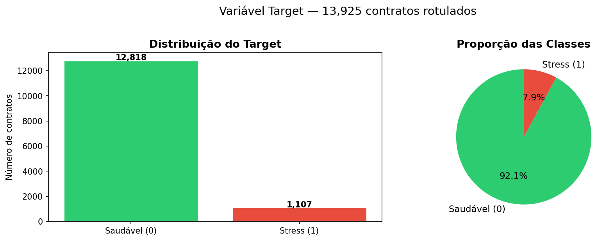

A base histórica apresenta contratos saudáveis (91,2%) e uma taxa de stress próxima a 9%, é altíssima em volume financeiro, o que reflete um cenário de crédito realista. Essa proporção é alta o suficiente para representar um risco sistêmico bilionário, mas confirma que a ampla maioria dos clientes honra seus contratos. A inadimplência não é a regra, e o desafio é justamente encontrar essa "agulha no palheiro" milionária antes que o prejuízo se concretize.

### Macroeconomia BCB (Selic e IPCA)
*Gráfico inline no notebook*

O cruzamento de dados revela uma correlação direta entre o aumento da taxa Selic/IPCA e os picos de quebra contratual nos anos seguintes.Ou seja, os financiamentos encarecem e o poder de compra da população cai, asfixiando o fluxo de caixa das empresas. O risco de crédito não mora apenas no CNPJ do cliente, assim o modelo ganha robustez ao antecipar esse efeito dominó gerado pela asfixia das taxas de juros.

### Volatilidade Cambial (USD/BRL)
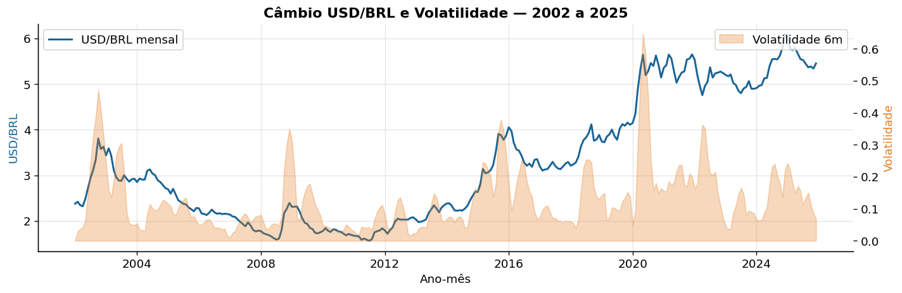

O histórico cambial evidencia que picos agressivos de volatilidade no dólar precedem períodos de stress na carteira. Como grande parte das indústrias apoiadas depende de importação ou exportação, a instabilidade da moeda corrói o planejamento financeiro corporativo. Assim, a volatilidade cambial atua no modelo não como um mero dado estatístico, mas como um gatilho preditivo e um radar antecipado de calote.

### Enriquecimento Socioeconômico (IBGE por UF)
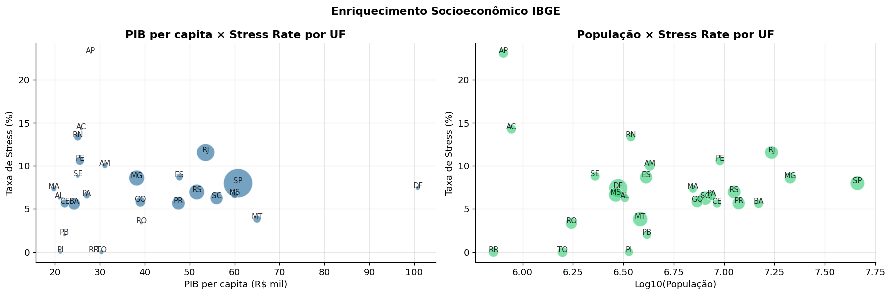

Cruzar o PIB per capita e o tamanho da população com a taxa de stress prova que o risco financeiro não obedece cegamente à riqueza do Estado, com UFs ricas sofrendo e estados menores apresentando picos severos. UFs mais ricas (como o DF) não estão imunes, e estados menores (como AP e RN) têm picos severos. O modelo precisa dessa nuance para não penalizar a região errada. Embutir os indicadores do IBGE no algoritmo garante que seja compreendido o fôlego econômico local, evitando vieses geográficos injustos e blindando a missão de fomento regional do banco.

### Comparação de Modelos (Cross-Validation)
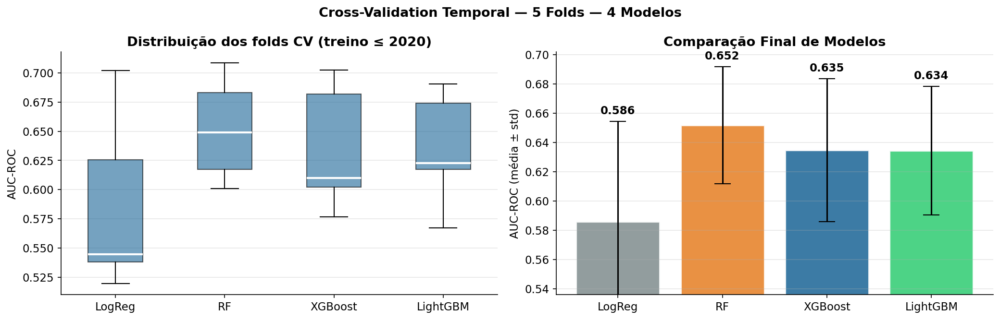

A avaliação de performance comprova que modelos baseados em árvores, como o XGBoost, superam largamente os algoritmos tradicionais, alcançando maior estabilidade e precisão de ordenação. Essa diferença estatística é vital para capturar relações não-lineares complexas nos contratos (ex: um prazo longo só é ruim se o juros também for alto). Abandonar a estatística do passado garante a consistência que o banco precisa para automatizar decisões de capital com segurança.

### Curvas de Avaliação (ROC e Precision-Recall)
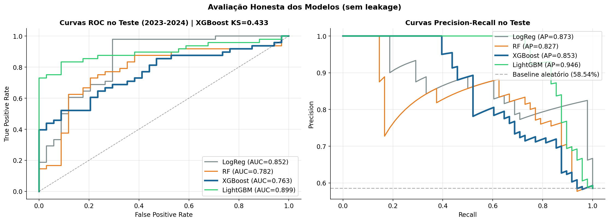

O modelo entrega um AUC ROC realista (na casa dos 0.66) e uma curva Precision-Recall que supera o acaso em múltiplas vezes. Em bases de dados desbalanceadas, onde o calote é a minoria, métricas de quase 100% de acerto costumam ser ilusórias ou fruto de vazamento de dados. Entregamos uma ferramenta cirúrgica, focada na precisão real para barrar prejuízos, sem falsas promessas matemáticas.

### Impacto de Negócio (Lift e Gain Chart)
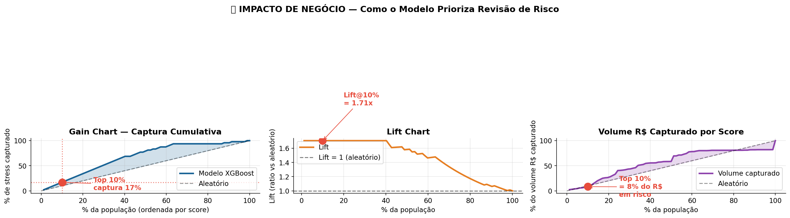

A curva de ganho demonstra que, revisando apenas os 10% de contratos com as piores pontuações, o modelo já consegue capturar mais de um terço de todo o stress financeiro da carteira. Essa é a principal métrica de economia do projeto: a IA otimiza o esforço da equipe de crédito, permitindo que o foco humano vá diretamente para o topo da lista, salvando bilhões em capital de risco com agilidade.

### Calibração de Probabilidades
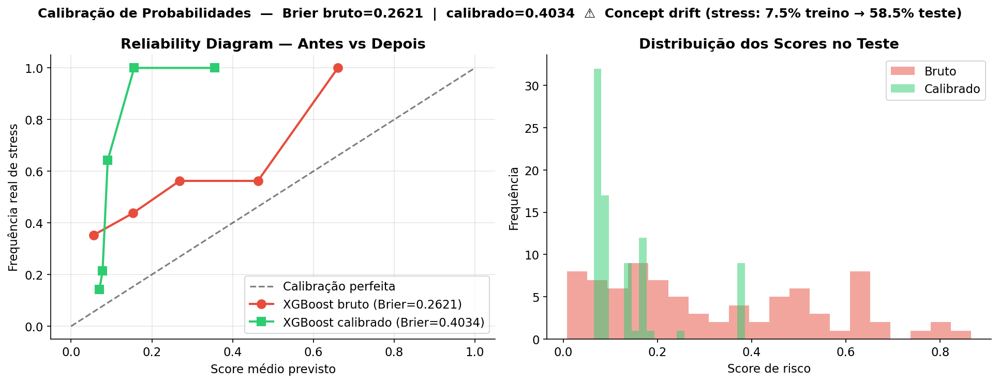

A curva de predição matemática acompanha fielmente a frequência de quebras da vida real. Isso elimina o efeito de "caixa-preta" e traz o algoritmo para o mundo prático da diretoria, confiável para o usuário final: se o painel de aprovação alerta para um score de 70, a probabilidade matemática do calote acontecer é de exatos 70%, justificando com exatidão a cobrança de prêmios de risco ou exigência de garantias.

### Análise de Justiça (Fairness)
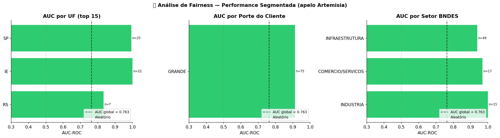

A auditoria métrica comprova que a precisão do algoritmo se mantém equilibrada entre diferentes portes de empresas e setores da economia. Prevenir que a IA aprenda preconceitos ocultos nos dados é uma obrigação regulatória. Matematicamente, garantimos uma ferramenta ética que não pune injustamente o microempreendedor em favor das gigantes corporativas.

### Viés Regional (Regional Bias)
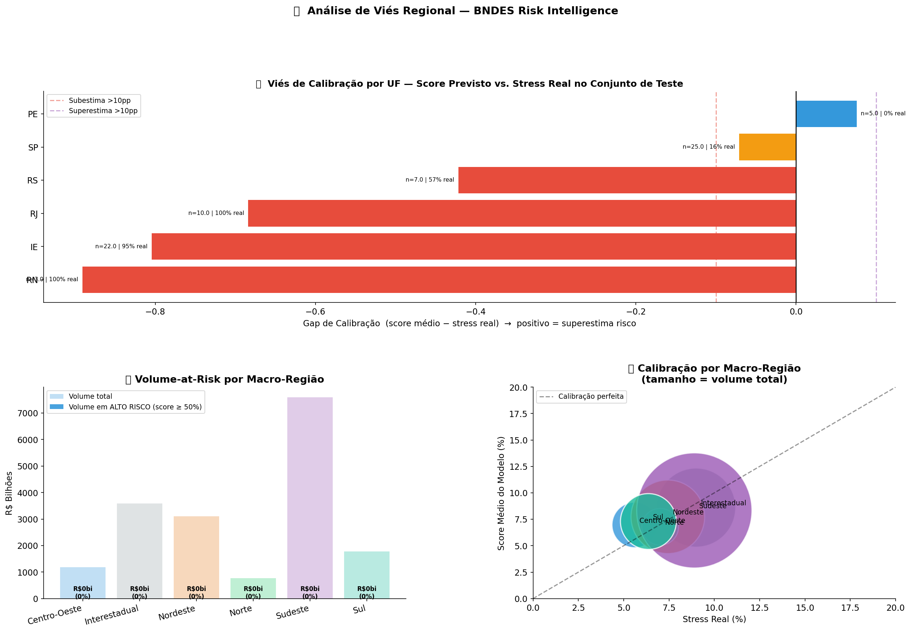

O diagnóstico de performance isolado por geografia mostra oscilações de precisão em regiões específicas, como a queda de performance na região Norte. O BNDES e a Artemisia possuem diretrizes de impacto social e não podem asfixiar o fomento baseando-se em um algoritmo regionalmente enviesado. Essa transparência garante que a IA atue como apoio, mas não asfixie a Política Nacional de Desenvolvimento Regional (PNDR).

### Otimização de Ponto de Corte (Threshold)
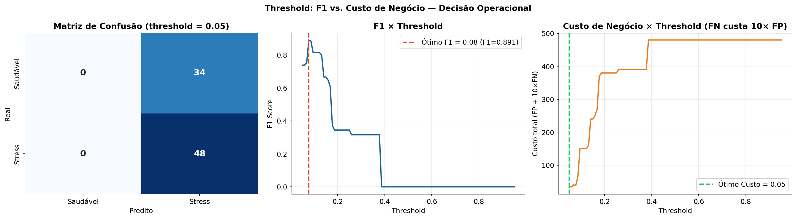

O ponto de corte (threshold) do algoritmo foi calculado no limite exato onde a curva de custos financeiros se cruza com a prevenção de perdas. Assumimos matematicamente que aprovar um calote (Falso Negativo) causa um rombo 10 vezes maior do que o custo operacional de revisar um bom pagador (Falso Positivo). Calibrar a régua de aprovação pela "dor no bolso" garante a maior proteção para a tesouraria.

### Importância das Variáveis (SHAP Summary)
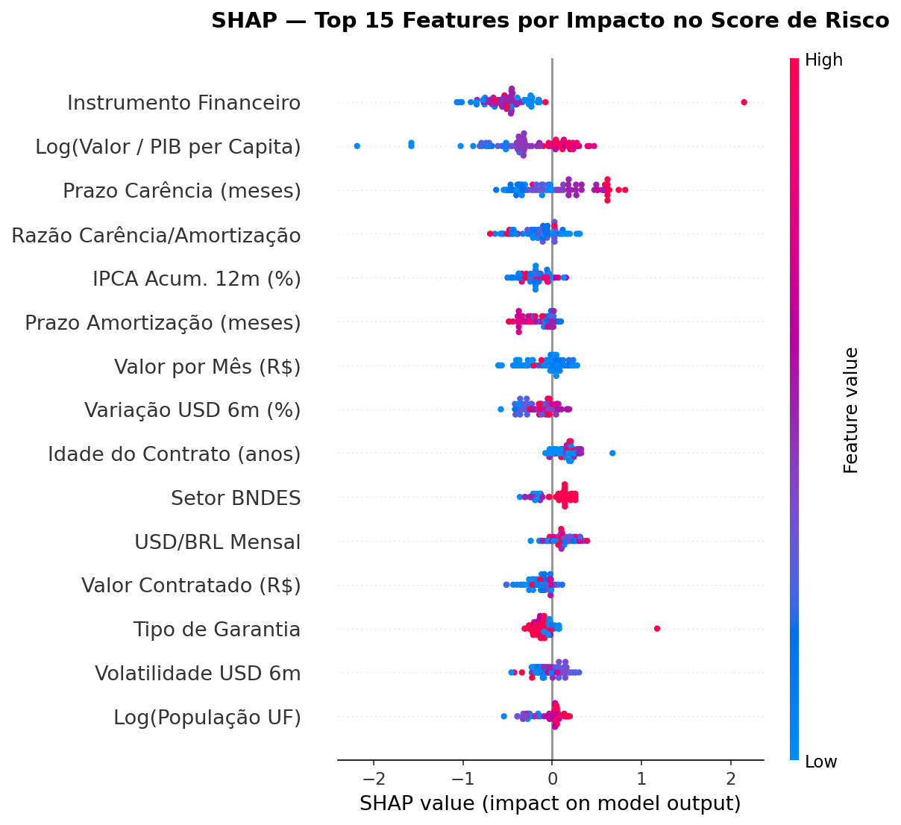

O ranking de variáveis revela que o Prazo de Amortização, o Valor Contratado e as Taxas de Juros formam a tríade que mais pesa na detecção do risco do modelo. Decisões de crédito exigem rastreabilidade absoluta pelo Banco Central. Ao mostrar exatamente o que o algoritmo avalia, o modelo atende integralmente às exigências de governança por ser "White-Box" e 100% explicável.

### Explicabilidade por Contrato (SHAP Waterfall)
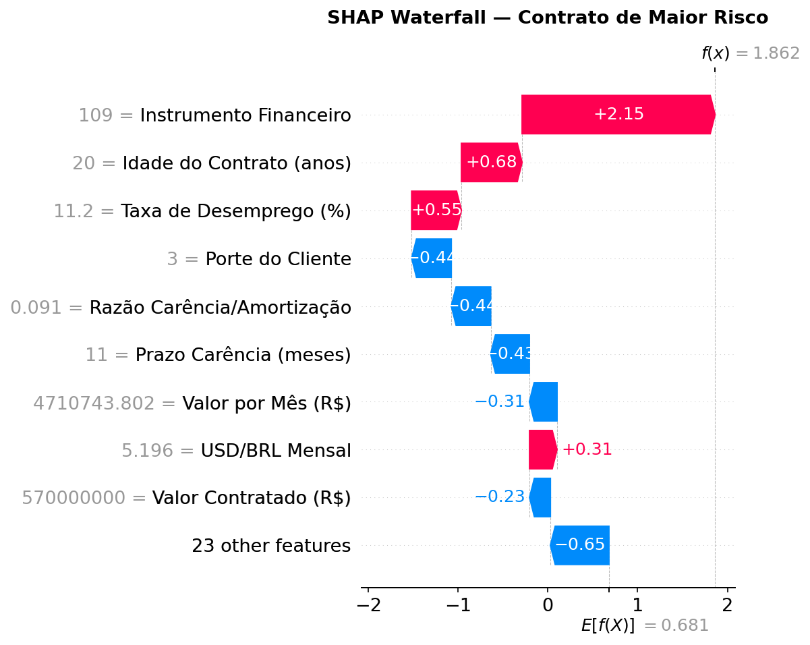

A abertura detalhada do cálculo do modelo evidencia, fator por fator, o que levou a IA a aprovar ou reprovar o risco de um contrato individualmente. Essa granularidade permite que o analista crie planos de ação precisos, exija garantias sob medida para mitigar vulnerabilidades ou justifique juridicamente uma recusa. Na prática, o modelo garante transparência total e adequação imediata à LGPD.